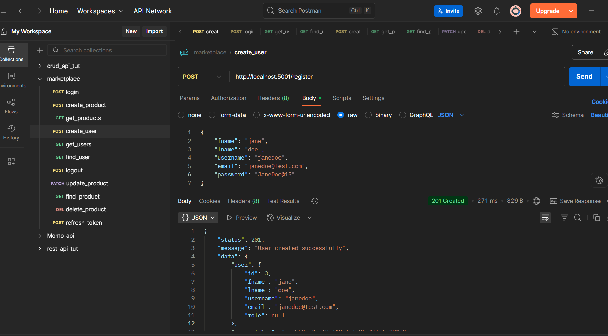
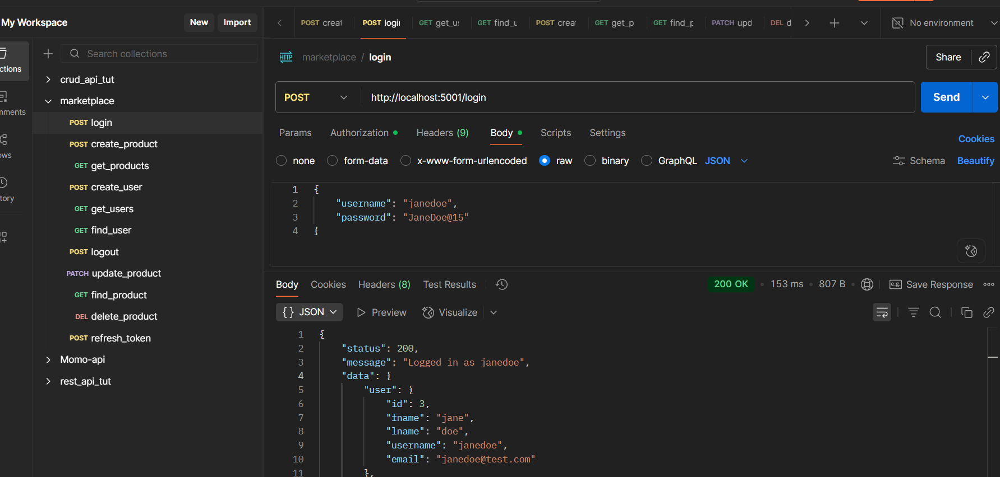
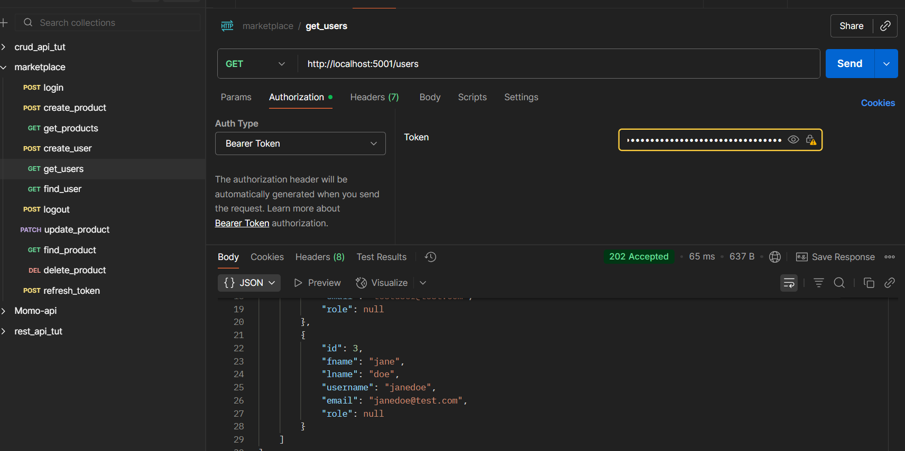
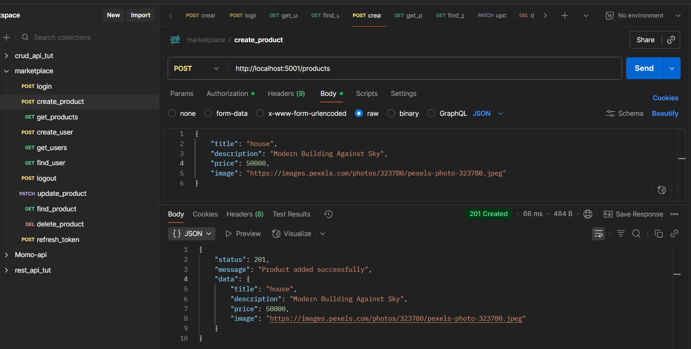
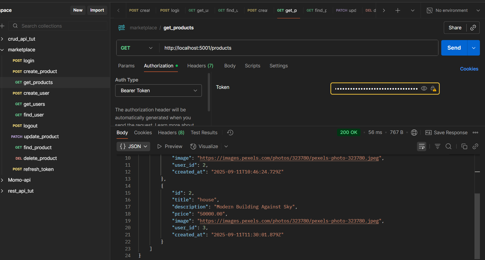
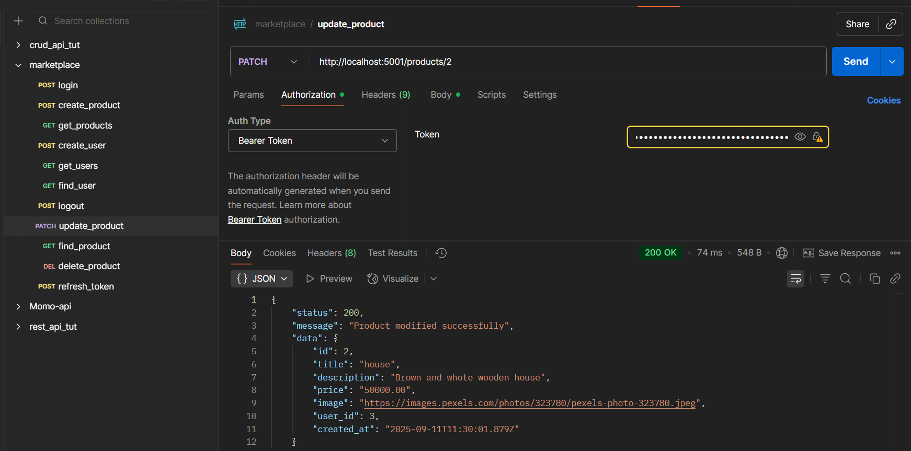
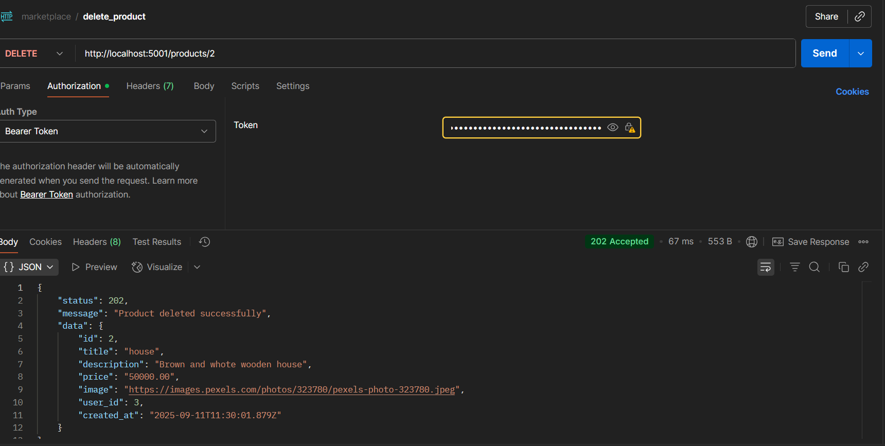

# Marketplace API

A **Node.js + Express** REST API for user authentication and CRUD operations for product management.

---

## Features

- User registration & login with secure password hashing (`bcrypt`)
- JWT-based authentication (access & refresh tokens)
- Logout and token revocation
- Product management (CRUD)
- Role based access control (with **admin** role)
- Users can:
    - View all products
    - Search for a particular product
    - Create new products
    - Update or delete products (**only those created by themselves**)
- Admin can:
    - Perform actions like any user
    - See other user information (**except password**)
- Input validation using **Joi**
- Environment variable configuration with **dotenv**

## Tech stack

- **Backend:** Node.js, Express.js
- **Database:** PostgreSQL
- **Auth:** JWT (Access & Refresh Tokens), bcrypt
- **Validation:** Joi
- **Environment Config:** dotenv
- **API Platform:** Postman

## Database structre

### Users table

- Stores user information during registraion (firstName, lastName, username, email, password, role)
- Uses bcrypt to hash passwords before storing for security

### Product table

- Stores information about products created (title, description, price, image)
- It is not a good practice to store images in the database, so it's better to host them elsewhere and reference with the URL, for instance Amazon S3. So the image url is rather stored as a string

---

## Getting started

### Clone the repository 

```bash
git clone https://github.com/FonsahPageo/marketplace-api.git

cd marketplace-api

npm install

mv .env.example .env

npm run dev
```

**NOTE:** Edit the `.env` file to fill in the required parameters such as **database** **name**, **port** etc.

for instance

`.env`
```bash
PORT=8000
JWT_SECRET=supersecretkey
REFRESH_SECRET=superrefreshsecretkey
DB_USER=user
DB_HOST=host
DB_DATABASE=database
DB_PORTDB_PASSWORD=password
```

Open **Postman** or any API platform, create a new collection for the various endpoints, make requests to test the different API endpoints.

## API Documentation

Ensure to change **DB_HOST** and **DB_PORT** to the values defined in your `.env` file

### Authentication

#### Create User
POST /register


#### Login User
POST /login


#### View Users (only admin)
GET /users


#### Create product

POST /products


#### View products
GET /products


#### Modify product
PATCH /update


#### Delete product
DELETE /delete


## Notes
- When logging in, an access token is generated. it will be used as bearer authorization for creating and managing products as well as to logout.
- Products are associated with the ID of the user that created them, therefore can only be deleted by that user.
- Only persons with role=admin can see or search users. But everyone can view products, create products, delete their own products

